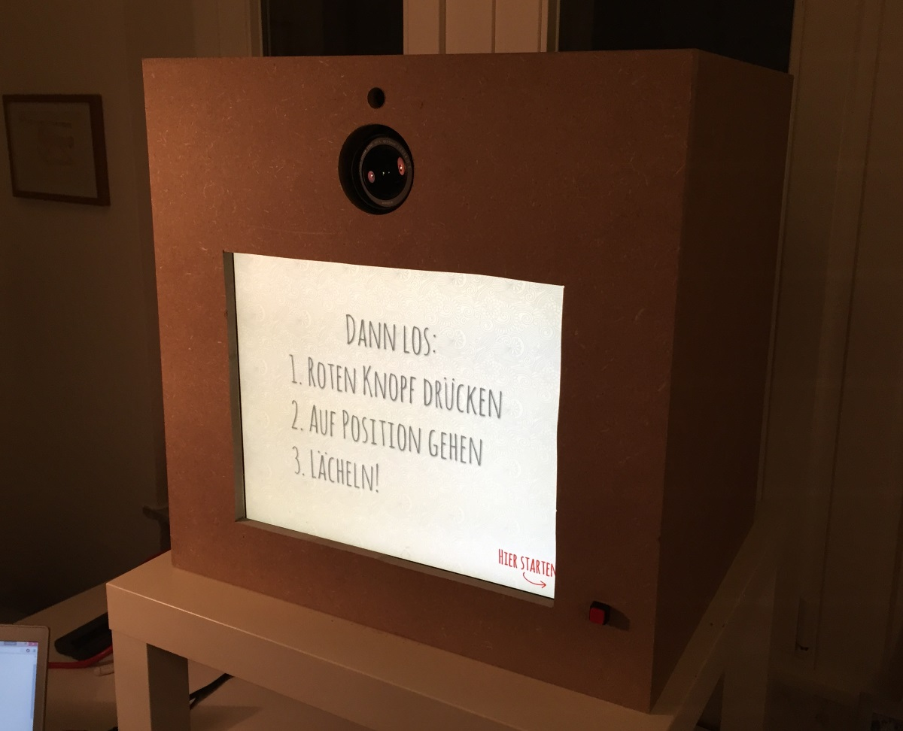
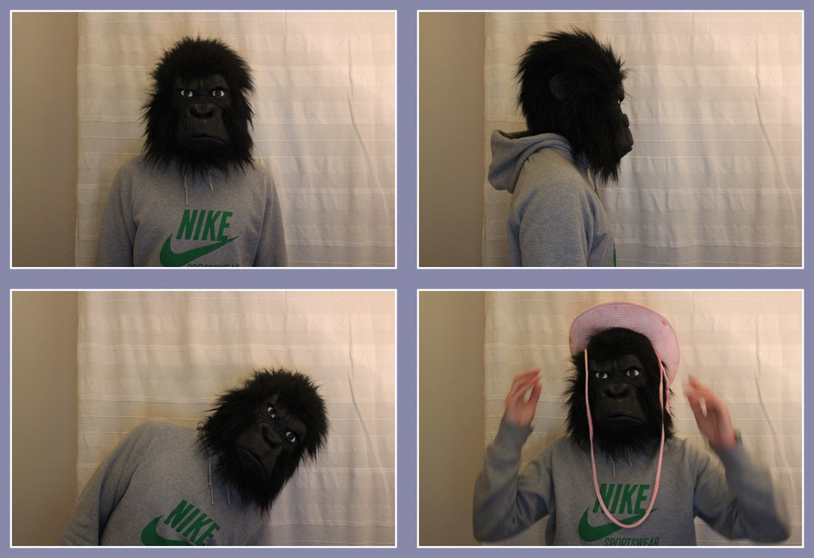

# photobox

The software for a private party photo booth, built to run on the following system setup:
- An old(ish) Medion E1210 Netbook, running Ubuntu 14.04
- An equally old(ish) Captiva e1701 flatscreen TFT (1280x1024px)
- A Canon EOS600 DSLR camera
- A Logitech C270 USB webcam
- A Canon SELPHY CP800 photo printer
- A push button wired to the electronics of a disassembled mouse

and using the following software:

- Chromium 40 in "kiosk mode"
- nginx to serve frontend resources
- nodejs as a custom server for triggering backend actions (specifically bash scripts)
- gphoto2 to interface with the DSLR
- imagemagick to work with the photos and create a montage

Note that the software was built specifically to run on this setup, so no other system configurations have been tested.

While it was not designed to be used by anyone but me, it might still be useful to you if you are trying to build something similar. 

This is what our finished (for now) booth looks like:

And this is an example of what it can produce:

